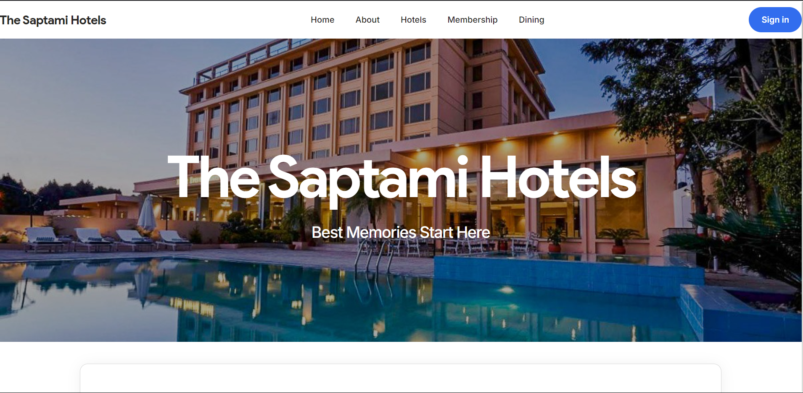
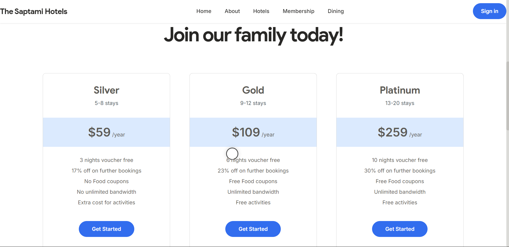
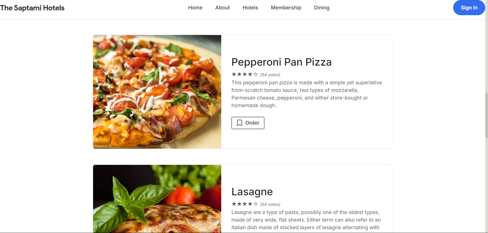

# 🏨 Hotel Management System Frontend

Welcome to the **Hotel Management System Frontend**! This project provides a visually appealing and user-friendly web interface that allows hotel guests to interact seamlessly with hotel services, from booking rooms to managing dining reservations. Developed using **HTML, CSS, and JavaScript**, the system enhances guest experience while streamlining hotel operations.

## 🌟 Project Overview

The Hotel Management System (HMS) is designed to elevate the hospitality industry by offering a responsive, interactive, and easy-to-navigate frontend. It allows users to:

- **Book Rooms**: Explore various room options and make real-time bookings.
- **Make Dining Reservations**: Reserve tables at hotel restaurants with personalized dining preferences.
- **Manage Memberships**: Register, view exclusive offers, and track loyalty points.
- **Select Rooms and Suites**: Filter and choose accommodations based on preferences and amenities.
- **View Multi-location Details**: Find hotel locations, view facilities, and get directions on an interactive map.

## ✨ Key Features

1. **Booking Functionality**  
   - Real-time availability updates for booking rooms and suites.
   - Simple and intuitive booking form for check-in, check-out dates, and guest preferences.

2. **Dining Reservation**  
   - Reserve tables at hotel dining venues and specify dietary requirements or special requests.

3. **Membership Management**  
   - Join membership programs to unlock benefits, discounts, and reward points tracking.

4. **Room and Suite Selection**  
   - Filter rooms based on size, view, or amenities to find the best match for guests.

5. **Multi-location Support**  
   - Information about different hotel locations, with interactive maps and nearby attractions.

6. **Responsive Design**  
   - Optimized for desktops, tablets, and smartphones to ensure a seamless experience across devices.

## 📋 Requirements

To run and view the project, you need:

- **Browser**: Chrome, Firefox, Safari, or Edge (latest versions recommended).
- **CSS Framework**: Tailwind CSS (linked via CDN).
- **Icons and Fonts**: Boxicons, Font Awesome, Inter Font from Google Fonts.
- **JavaScript Libraries**: Owl Carousel for interactive elements.

## 🖼️ Screenshots

Here are some previews of the HMS frontend interface:

### Home Page


### Booking Page


### Dining Reservations


## 🚀 Getting Started

1. **Clone the repository**:
   ```bash
   git clone https://github.com/your-username/hotel-management-frontend.git
   cd hotel-management-frontend
   ```

2. **Open the `index.html` file**:
   Open the project in a web browser by double-clicking on `index.html` or by launching it through a local web server.

## 🛠️ Implementation Details

The project is built on simple HTML, CSS, and JavaScript without a backend, focusing on user interaction and dynamic content. The following functionalities are implemented:

- **JavaScript Validation**: Validates user inputs for bookings, dining reservations, and memberships.
- **Dynamic SVG Icons**: Enhances the interface with scalable and visually consistent icons.
- **Custom CSS**: Styles defined in `assets/css/styles.css` and inline CSS for finer element control.

## ⚙️ Advantages and Limitations

### Advantages
- **Improved User Interaction**: Allows guests to book rooms, explore dining options, and more.
- **Dynamic Content**: Engaging visuals and smooth navigation.
- **Enhanced User Experience**: JavaScript functionality for seamless interaction.

### Limitations
- **Browser Compatibility**: Testing required for consistent behavior across browsers.
- **Security**: Client-side validation only; server-side validation recommended for secure operations.
- **No Backend Support**: This frontend implementation lacks database and server-side processing.

---

**Developed by Samyak Diwan**

This project was created as part of an academic assignment at NMIMS MPSTME, Mumbai Campus. If you'd like to collaborate or have any questions, feel free to reach out!

---

Feel free to replace the placeholder paths for the images with the actual file paths in your project or GitHub repository

